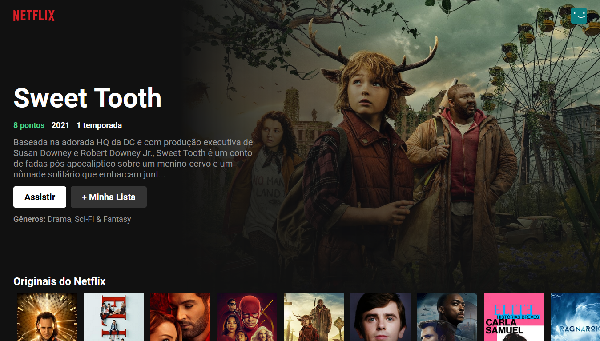

# cloningNetflix



## Sobre o projeto
Estava a procurar um projeto para aprender [React.JS](https://pt-br.reactjs.org/)
e também aprender mais em geral sobre HTML e CSS. Foi então
que cheguei a um tutorial fornecido pelo [Bonieky Lacerda](https://youtu.be/tBweoUiMsDg).

PS: Há somente a funcionalidade de landing page, não há log-in ou acesso aos filmes.

## Rodando a aplicação

### Pré-requisitos
Você precisará ter uma chave de API no [Tmdb](https://developers.themoviedb.org/3/getting-started/introduction),
e deverá coloca-lá em ```src/Tmdb.js```.

### Instalação
**Clonando o repositório**
```
$ git clone https://github.com/brenno3b/API-de-Cadastro

$ cd cloningNetflix
```

**Instalando as dependências**
```
$ yarn add
```
_or_

```
$ npm install
```

### Rodando o projeto

```
$ npm start
```

## Tecnologias

- [React.JS](https://pt-br.reactjs.org/)

### Entre em contato comigo

[](https://www.linkedin.com/in/brenno-barbosa-96a0841a2/)
[](mailto:brenno3b@gmail.com)
